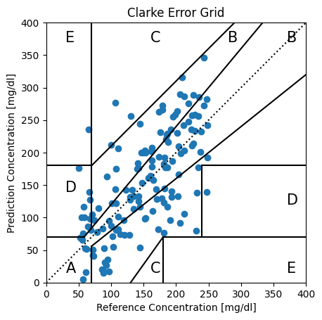

# ClarkeErrorGrid
This has the function for the Clarke Error Grid

## Repository structure
* All the code to generate Clarke Error Grids and assess where the data lies is located in `ClarkeErrorGrid.py`.
* Exemples of how to use the functions in `ClarkeErrorGrid.py` can be found in `example.ipynb`.

## Context

The Clarke Error Grid shows the differences between a blood glucose predictive measurement and a reference measurement, and it shows the clinical significance of the differences between these values.
The x-axis corresponds to the reference value and the y-axis corresponds to the prediction.
The diagonal line shows the prediction value is the exact same as the reference value.
This grid is split into five zones:

* **Zone A: Clinically Accurate**
    This zone holds the values that differ from the reference values no more than 20 percent
    or the values in the hypoglycemic range (<70 mg/dl).
    According to the literature, values in zone A are considered clinically accurate.
    These values would lead to clinically correct treatment decisions.

* **Zone B: Clinically Acceptable**
    This zone holds values that differe more than 20 percent but would lead to
    benign or no treatment based on assumptions.

* **Zone C: Overcorrecting**
    This zone leads to overcorrecting acceptable BG levels.

* **Zone D: Failure to Detect**
    This zone leads to failure to detect and treat errors in BG levels.
    The actual BG levels are outside of the acceptable levels while the predictions
    lie within the acceptable range

* **Zone E: Erroneous treatment**
    This zone leads to erroneous treatment because prediction values are opposite to
    actual BG levels, and treatment would be opposite to what is recommended.

## Credits

### Contributors: 
The python source code was originally created by [Trevor Tsue](https://github.com/suetAndTie), and modified by [David Gerard](https://github.com/David-GERARD).

This work is based on the Matlab Clarke Error Grid Analysis File Version 1.2 by: Edgar Guevara Codina codina@REMOVETHIScactus.iico.uaslp.mx March 29 2013, Copyright (c) 2008, Edgar Guevara Codina All rights reserved.

### References: 
* [1] Clarke, WL. (2005). "The Original Clarke Error Grid Analysis (EGA)." Diabetes Technology and Therapeutics 7(5), pp. 776-779. 
* [2] Maran, A. et al. (2002). "Continuous Subcutaneous Glucose Monitoring in Diabetic Patients" Diabetes Care, 25(2). 
* [3] Kovatchev, B.P. et al. (2004). "Evaluating the Accuracy of Continuous Glucose- Monitoring Sensors" Diabetes Care, 27(8). 
* [4] Guevara, E. and Gonzalez, F. J. (2008). Prediction of Glucose Concentration by Impedance Phase Measurements, in MEDICAL PHYSICS: Tenth Mexican Symposium on Medical Physics, Mexico City, Mexico, vol. 1032, pp. 259261. 
* [5] Guevara, E. and Gonzalez, F. J. (2010). Joint optical-electrical technique for noninvasive glucose monitoring, REVISTA MEXICANA DE FISICA, vol. 56, no. 5, pp. 430434.

Redistribution and use in source and binary forms, with or without 
modification, are permitted provided that the following conditions are 
met:

* Redistributions of source code must retain the above copyright 
notice, this list of conditions and the following disclaimer. 
* Redistributions in binary form must reproduce the above copyright 
notice, this list of conditions and the following disclaimer in 
the documentation and/or other materials provided with the distribution

THIS SOFTWARE IS PROVIDED BY THE COPYRIGHT HOLDERS AND CONTRIBUTORS "AS IS" 
AND ANY EXPRESS OR IMPLIED WARRANTIES, INCLUDING, BUT NOT LIMITED TO, THE 
IMPLIED WARRANTIES OF MERCHANTABILITY AND FITNESS FOR A PARTICULAR PURPOSE 
ARE DISCLAIMED. IN NO EVENT SHALL THE COPYRIGHT OWNER OR CONTRIBUTORS BE 
LIABLE FOR ANY DIRECT, INDIRECT, INCIDENTAL, SPECIAL, EXEMPLARY, OR 
CONSEQUENTIAL DAMAGES (INCLUDING, BUT NOT LIMITED TO, PROCUREMENT OF 
SUBSTITUTE GOODS OR SERVICES; LOSS OF USE, DATA, OR PROFITS; OR BUSINESS 
INTERRUPTION) HOWEVER CAUSED AND ON ANY THEORY OF LIABILITY, WHETHER IN 
CONTRACT, STRICT LIABILITY, OR TORT (INCLUDING NEGLIGENCE OR OTHERWISE) 
ARISING IN ANY WAY OUT OF THE USE OF THIS SOFTWARE, EVEN IF ADVISED OF THE 
POSSIBILITY OF SUCH DAMAGE.
